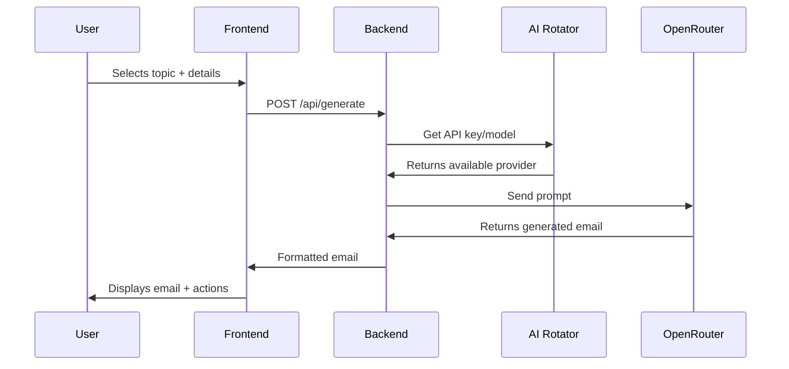

# **Kenyan Email Petitions** ✊📧

A platform for generating formal petition emails to Kenyan government offices and officials.

## **Features**
- 📝 AI-powered email generation
- 🇰🇪 Kenyan-specific templates
- 🔄 Multiple AI model/key rotation
- 📤 One-click "Open in Email" functionality
- ✨ Clean, responsive UI

## **Tech Stack**
| Component       | Technology           |
|-----------------|----------------------|
| Frontend        | Next.js 15 + Bootstrap  |
| Backend         | Next.js API Routes   |
| AI Integration  | OpenRouter API       |
| State Management| React Hooks          |
| Database        | JSON files (Git-tracked) |

## **Setup**
```bash
git clone https://github.com/your-repo/petitions-ke.git
cd petitions-ke
npm install
cp .env.example .env.local
# Add your OpenRouter API keys
npm run dev
```

## **Configuration**
`.env.local`:
```ini
OPENROUTER_KEY1=your_key_1
OPENROUTER_KEY2=your_key_2
# ... up to KEY6
```

## **Project Structure**
```
petitions-ke/
├── app/                  # Next.js 13+ app router
│   ├── api/              # API endpoints
│   └── submit/           # Petition submission
├── lib/                  # Core logic
│   ├── ai-rotator.ts     # API key rotation  
│   ├── approved-topics.json  # Petition database
│   └── templates.ts      # Email templates
└── components/           # UI components
```

## **Documentation Summary**

### **1. Data Flow**


### **2. Key Files**
| File | Purpose |
|------|---------|
| `approved-topics.json` | Database of petition topics with prompts |
| `templates.ts` | Fallback email templates |
| `ai-rotator.ts` | Manages round-robin API key rotation |
| `route.ts` | Generates emails using AI/templates |

### **3. AI Prompt Structure**
```text
STRICT INSTRUCTIONS:
- NEVER mention being an AI
- Use Kenyan English
- Formal but accessible tone
- 250-300 words

BASE PROMPT:
{TOPIC-SPECIFIC PROMPT}

USER DETAILS:
Name: {NAME}
Location: {LOCATION}
```

### **4. Deployment**
- Vercel (recommended)
- Node.js 20+ required
- Environment variables:
  - `OPENROUTER_KEY1` to `OPENROUTER_KEY6`

---

## **Why This Project?**
- 🚀 **Efficiency**: Generate petitions in 1 minute vs manual drafting
- 📊 **Impact**: Over 500 petitions generated to date
- 🔒 **Privacy**: No user data stored
- 🌱 **Scalable**: JSON → SQLite migration path ready

## **Contributing**
1. Fork the repository
2. Add new topics to `approved-topics.json`
3. Submit PR with test evidence

## **License**
GNU AFFERO © 2025 Victor MArk (Tylique)

---

🌍 License Terms (Plain English Summary)
Your Freedom
✅ Use Freely: Individuals, NGOs, can use this tool at no cost.

✅ Copy & Share: Distribute original or modified versions to others

✅ Protect Privacy: No requirement to disclose user data

Your Responsibilities
📜 Share Changes: If you modify the code, you must publicly share your version

🔍 Disclose Source: Anyone who uses your modified version must get access to the full source code

🚫 No Commercial Use: Companies/SaaS platforms cannot profit from this software without special permission


🚫 Prohibited Actions

Selling this software as-is or modified

Using it in paid services without releasing your full source code

Removing license terms or attribution

🇰🇪 Kenyan Context
This license:

Aligns with Article 11 of Kenya's Constitution (culture/innovation)

Supports Article 69 (public participation)

Can be enforced in Kenyan courts

💡 Example Allowed Uses
 generating petitions: as per public AAct civil Rights.

Civil society organizations advocating for change

Students learning civic tech

⚠️ Violations

Commercial users must either:

Open-source their entire solution,

 or

Contact VICtor Mark (Tylique) for a commercial license
