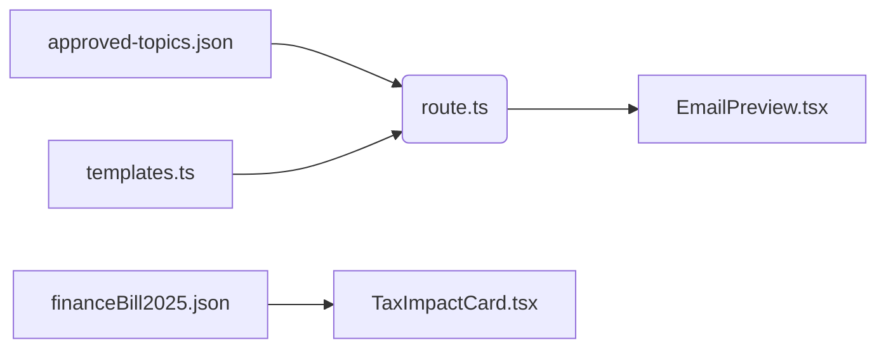

```markdown
# Kenyan Email Petitions - Project Structure

## Root Directory
```
/
├── 📁 **Configuration Files**
│   ├── `.eslintignore` - ESLint ignore rules
│   ├── `.gitignore` - Git exclusion rules  
│   ├── `eslint.config.mjs` - ESLint configuration  
│   ├── `next.config.ts` - Next.js settings  
│   ├── `tsconfig.json` - TypeScript config  
│   ├── `package.json` - NPM dependencies  
│   └── `README.md` - Project documentation  

├── 📁 **App Logic**  
│   ├── `structure.py` - (Legacy/Utility)  
│   └── `structure.txt` - Structure notes  

## 📁 app/ - Next.js Application
```
├── 📁 **Core Files**  
│   ├── `layout.tsx` - Root layout  
│   ├── `page.tsx` - Homepage  
│   ├── `globals.css` - Global styles  
│   └── `metadata.ts` - SEO metadata  

├── 📁 **API Routes**  
│   ├── 📁 generate/  
│   │   └── `route.ts` - AI email generation  
│   └── 📁 submit/  
│       └── `route.ts` - Petition submissions  

├── 📁 **Pages**  
│   ├── 📁 bill/ - Finance Bill 2025  
│   │   ├── `page.tsx`  
│   │   └── `page.module.css`  
│   └── 📁 submit/  
│       └── `page.tsx` - Submission form  

## 📁 components/ - UI Components
```
├── `EmailPreview.tsx` - Generated email display  
├── `TaxImpactCard.tsx` - Finance bill analysis card  
└── `TaxImpactCard.module.css` - Card styles  

## 📁 lib/ - Business Logic & Data
```
├── `ai-rotator.ts` - AI API key rotation  
├── `approved-topics.json` - Active petition topics  
├── `financeBill2025.json` - Bill analysis data  
├── `submissions.json` - User submissions (dev)  
├── `templates.ts` - Email templates  
├── `types.ts` - TypeScript definitions  
└── `github.ts` - GitHub integration  

## 📁 public/ - Static Assets
```
├── `logo.svg` - Main logo  
├── `petition.svg` - Petition icon  
├── `1p.svg`/`lp.svg` - Partner logos  
└── Other SVG icons  

## 📁 types/ - Specialized Types
```
└── `financeBill.ts` - Type definitions for bill analysis  

## Key Relationships


**Maintenance Notes**:
- JSON files act as lightweight databases
- All AI logic flows through `lib/ai-rotator.ts`
- Finance bill features are modularly separated

```
Key Elements Explained:

    User Flow (Pink):

    Interacts with Next.js frontend

    Triggers API routes

    Frontend (Blue):

    components/: Reusable UI pieces

    globals.css: Shared styles

    Backend (Yellow/Orange):

    AI rotator handles key/model rotation

    JSON files act as databases

    Templates provide fallback content

    External Services (Green):

    OpenRouter for AI generation

    Static assets for UI


```
%%{init: {'theme':'neutral', 'fontFamily':'Fira Code'}}%%
flowchart TD
    subgraph User
        A[User] -->|Selects Topic| B(Next.js Frontend)
        A -->|Submits Form| C[API Routes]
    end

    subgraph Frontend["app/"]
        B -->|Uses| D[components/]
        D --> EmailPreview
        D --> TaxImpactCard
        B -->|Styles| E[globals.css]
    end

    subgraph Backend["API & Data"]
        C -->|Generates Emails| F[lib/ai-rotator.ts]
        C -->|Saves Data| G[lib/submissions.json]
        F -->|Uses| H[approved-topics.json]
        F -->|Fallback| I[templates.ts]
    end

    subgraph External
        F -->|Calls| J[[OpenRouter AI]]
        B -->|Displays| K[[Public SVGs]]
    end

    style A fill:#f9f,stroke:#333
    style B fill:#e1f5fe,stroke:#039be5
    style C fill:#b3e5fc,stroke:#0288d1
    style F fill:#ffecb3,stroke:#ffa000
    style J fill:#dce775,stroke:#afb42b

```
